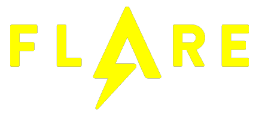

# FlareOn-9 Write-ups

<p align="center">

</p>

This repo contains scripts/programs that I developed during the [FLAREON-9](http://flare-on.com/).

Many thanks to the FLARE team. It was an interesting journey and I liked it a lot :D

Read original write-ups here: [flareon9-writeups](https://pwn.report/2022/11/12/flareon9-writeups.html).

## Challenges

- [1. 🗿 flaredle](#1--flaredle)
- [2. 🔳 pixelpoker](#2--pixelpoker)
- [3. 🎱 magic8ball](#3--magic8ball)
- [4. 🔙 darn_mice](#4--darn_mice)
- [5. 🔎 t8](#5--t8)
- [6. 🧪 alamode](#6--alamode)
- [7. 🛸 anode](#7--anode)
- [8. 💀 backdoor](#8--backdoor)
- [9. 🗝 encryptor](#9--encryptor)
- [10. 💻 Nur_getraumt](#10--nur_getraumt)
- [11. 📖 XXX](#11--xxx)

### 1. 🗿 flaredle

```txt
You probably won't win. Maybe you're like us and spent the year playing Wordle. 
We made our own version that is too hard to beat without cheating.
```

__TLDR__: The hardest challenge ever.... No way you could solve it with `strings`.

Writeup link: [🗿 flaredle](https://pwn.report/2022/11/12/flareon9-writeups.html#1--flaredle)

### 2. 🔳 pixelpoker

```txt
I said you wouldn't win that last one. I lied. The last challenge was basically a captcha.
Now the real work begins. Shall we play another game?
```

__TLDR__: You can decrypt one pixel at a time, but if you find a particular pixel, the whole image will be decrypted.

Writeup link: [🔳 pixelpoker](https://pwn.report/2022/11/12/flareon9-writeups.html#2--pixelpoker)

### 3. 🎱 magic8ball

```txt
You got a question? Ask the 8 ball!
```

__TLDR__: Find the magic phrase and shake the ball in the right order.

Writeup link: [🎱 magic8ball](https://pwn.report/2022/11/12/flareon9-writeups.html#3--magic8ball)

### 4. 🔙 darn_mice

```txt
"If it crashes its user error." -Flare Team
```

__TLDR__: RET, RET, RET, ...

Writeup link: [🔙 darn_mice](https://pwn.report/2022/11/12/flareon9-writeups.html#4--darn_mice)

Files list:

- [bruteforce.py](04_darn_mice/solve.py) - Finds "correct" argument value using byte-by-byte bruteforce
- [solve.py](04_darn_mice/solve.py) - Finds correct argument value

### 5. 🔎 t8

```txt
FLARE FACT #823: Studies show that C++ Reversers have fewer friends on average than normal people do. 
That's why you're here, reversing this, instead of with them, because they don't exist.

We’ve found an unknown executable on one of our hosts. The file has been there for a while, 
but our networking logs only show suspicious traffic on one day. Can you tell us what happened?
```

__TLDR__: Reverse it all the way to the end. And either find a random seed or spoof a hash value to decrypt the flag.

Writeup link: [🔎 t8](https://pwn.report/2022/11/12/flareon9-writeups.html#5--t8)

Files list:

- [crack.py](05_t8/crack.py) - Generates a hash to decrypt the flag
- [proxy.py](05_t8/proxy.py) - Packets replier

### 6. 🧪 alamode

```txt
FLARE FACT #824: Disregard flare fact #823 if you are a .NET Reverser too.

We will now reward your fantastic effort with a small binary challenge. You've earned it kid!
```

__TLDR__: Open it in IDA as a PE and not as a .NET file. Find the RC4 key and decrypt the flag. Profit!

Writeup link: [🧪 alamode](https://pwn.report/2022/11/12/flareon9-writeups.html#6--alamode)

Files list:

- [crack.py](06_alamode/crack.py) - Decrypts the flag
- [proxy.py](06_alamode/decode_strings.py) - Ida script to decrypt strings

### 7. 🛸 anode

```txt
You've made it so far! I can't believe it! And so many people are ahead of you!
```

__TLDR__: Just, ... just do it! Seriously. Iteratively find all corner cases, deobfuscate further and further, and you will get clean flag constraints. In the end, I used bitwuzla-powered DSE to find the flag.

Writeup link: [🛸 anode](https://pwn.report/2022/11/12/flareon9-writeups.html#7--anode)

Files list:

- [solve_angr.py](07_anode/solve_angr.py) - Angr-powered solver (didn't work)
- [solve_triton.py](07_anode/solve_triton.py) - Triton-powered solver (successfully found the flag)
- [deobfuscate-unflatten.js](07_anode/deobfuscate-unflatten.js) - Deobfuscation script part 1
- [deobfuscate-optimize-rand-inlining.js](07_anode/deobfuscate-optimize-rand-inlining.js) - Deobfuscation script part 2
- [deobfuscate-constant-propagation.js](07_anode/deobfuscate-constant-propagation.js) - Deobfuscation script part 3

### 8. 💀 backdoor

```txt
I'm such a backdoor, decompile me why don't you...
```

__TLDR__: That was a HELL! The most time-consuming challenge for me. I've spent 30+ hours on it (mostly because of some silly mistakes that hindered my progress). But the idea behind is straightforward - write a deobfuscator :D The next step is to reverse the code and find a way to generate the correct key.

Writeup link: [💀 backdoor](https://pwn.report/2022/11/12/flareon9-writeups.html#8--backdoor)

Files list:

- [Deobfuscator](08_backdoor/Deobfuscator/Deobfuscator) - C# dnlib-based deobfuscator
- [Implant](08_backdoor/Deobfuscator/Implant) - C# DLL implant
- [ProxyImplant](08_backdoor/Deobfuscator/ProxyImplant) - C# DLL proxy implant (loads the Implant)

### 9. 🗝 encryptor

```txt
You're really crushing it to get this far. This is probably the end for you. Better luck next year!
```

__TLDR__: This is an RSA challenge. However, the flag was encrypted using a private exponent, and you're given a public one. So you can simply decrypt the flag using the public exponent. That's how RSA works.

Writeup link: [🗝 encryptor](https://pwn.report/2022/11/12/flareon9-writeups.html#9--encryptor)

Files list:

- [decryptor.py](09_encryptor/decryptor.py) - Restores ChaCha key and decrypts the flag

### 10. 💻 Nur_getraumt

```txt
This challenge is a Macintosh disk image (Disk Copy 4.2 format, for those who need to know) containing a 68K Macintosh program. 
You must determine the passphrase used to decode the flag contained within the application. 
Super ResEdit, an augmented version of Apple's ResEdit resource editor which adds a disassembler, is also included on the disk image to help you complete the challenge, though you will likely also need to do some outside research to guess the passphrase. 
This application can be run on any Macintosh emulator (or any real Macintosh from as far back as a Mac Plus running System 6.0.x up to a G5 running Classic). 
The setup of the emulation environment is part of the challenge, so few spoilers live here, but if you want to save yourself some headaches, Mini vMac is a pretty good choice that doesn't take much effort to get up and running compared to some other options. 
This application was written on a Power Macintosh 7300 using CodeWarrior Pro 5, ResEdit, and Resourcerer (my old setup from roughly 1997, still alive!). 
It was tested on a great many machines and emulators, and validated to run well on Mac OS from 6.0.8 through 10.4. Happy solving! Be curious!
```

__TLDR__: Install the mini vMac and run the program. And either you are smart enough to try the first line of 99 Luftballons lyrics (__in Deutsche!__) or not (like me). In the second case, just sit around for a while, get an idea of how the check is done (it's a simple XOR), and try a known plaintext attack ("@flare-on.com"). Get part of the song lyrics, go to Google once again and find the rest of the lyrics. And you're all set.

Writeup link: [💻 Nur_getraumt](https://pwn.report/2022/11/12/flareon9-writeups.html#10--nur_getraumt)

Files list:

- [crack.py](10_Nur_getraumt/crack.py) - Performs a known plaintext attack

### 11. 📖 XXX

```txt
Protection, Obfuscation, Restrictions... Oh my!!

The good part about this one is that if you fail to solve it I don't need to ship you a prize.
```

__TLDR__: Open it in API Monitor, and find out that it tries to connect to "http[:]//evil[.]flare-on.com/". Add an entry to the hosts file. Rerun the program. Observe a request to the localhost. Find out that it is encrypted in some way. Try guessing. Maybe it's xor? Add breakpoints to python's `xor` functions. Find out that the number of XOR calls exactly matches the number of bytes in the flag. Use FRIDA to hook `xor` function and dump the flag. Profit!

Writeup link: [📖 XXX](https://pwn.report/2022/11/12/flareon9-writeups.html#11--XXX)

Files list:

- [crack.py](11_the_challenge_that_shall_not_be_named/hook-frida.js) - Frida script to hook `xor` function and dump the flag
- [run_frida.py](11_the_challenge_that_shall_not_be_named/run_frida.py) - Python Frida runner
